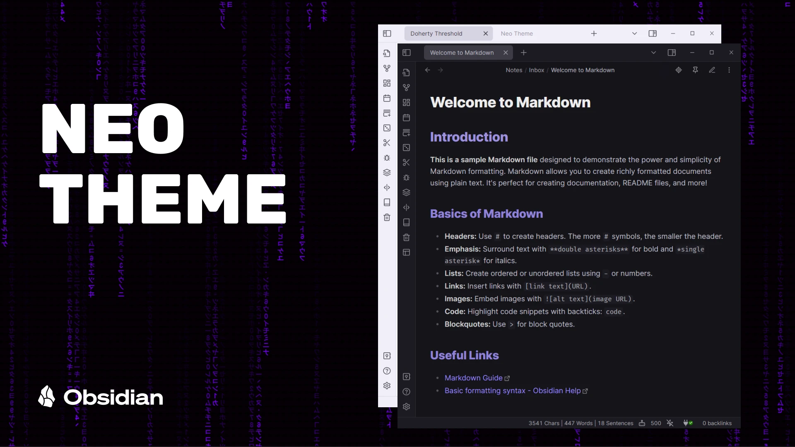
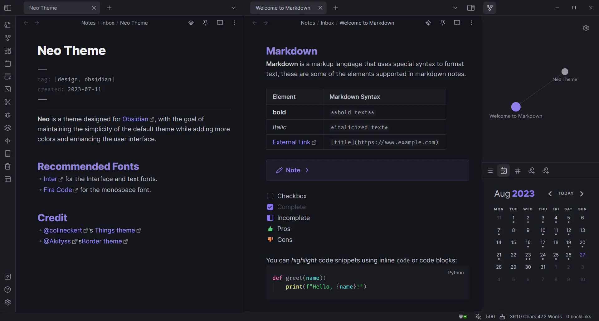
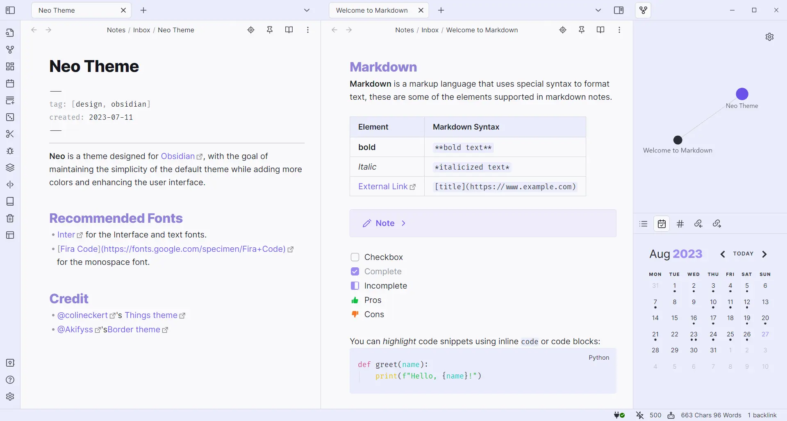
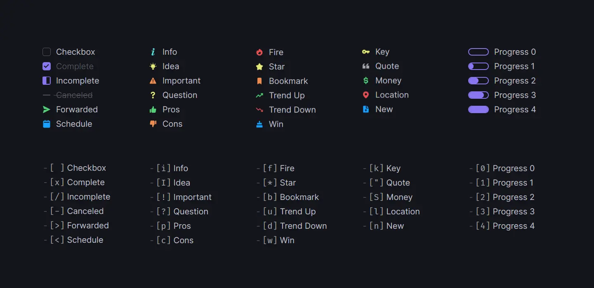
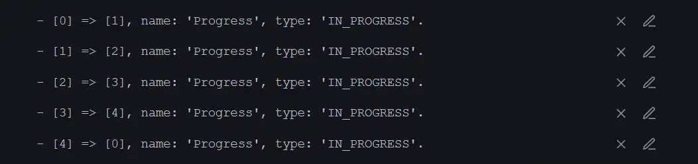

# Neo Theme

**Neo** is a theme designed for [Obsidian](https://obsidian.md/), with the goal of maintaining the simplicity of the default theme while adding more colors and enhancing the user interface.



## Features

- Dark and light theme support
- Mobile support
- Alternate Tabs
- Headings indicator
- Pointer cursor for clickable elements
- Alternate checkboxes

## Screenshots



<details>
  <summary>Light Theme</summary>



</details>

## Supported plugins

- [Dataview](https://github.com/blacksmithgu/obsidian-dataview)
- [Tasks](https://github.com/obsidian-tasks-group/obsidian-tasks)
- [Kanban](https://github.com/mgmeyers/obsidian-kanban)
- [Style settings](https://github.com/mgmeyers/obsidian-style-settings)
- [Calendar](https://github.com/liamcain/obsidian-calendar-plugin)
- [Hover editor](https://github.com/nothingislost/obsidian-hover-editor)

## Alternate checkboxes

Neo offers a variety of alternate checkbox types to help you highlight different task statuses.



```markdown
- [ ] Checkbox
- [x] Complete
- [/] Incomplete
- [-] Canceled
- [>] Forwarded
- [<] Schedule

- [i] Info
- [I] Idea
- [!] Important
- [?] Question
- [p] Pros
- [c] Cons

- [f] Fire
- [*] Star
- [b] Bookmark
- [u] Trend Up
- [d] Trend Down
- [w] Win

- [k] Key
- ["] Quote
- [S] Money
- [l] Location
- [n] New

- [0] Progress 0
- [1] Progress 1
- [2] Progress 2
- [3] Progress 3
- [4] Progress 4
```

<details>
  <summary>Task plugin statuses for progress checkboxes</summary>



</details>

## Recommended Fonts

- [Inter](https://fonts.google.com/specimen/Inter) for interface and text fonts.
- [Fira Code](https://fonts.google.com/specimen/Fira+Code) for monospace font.

## Disclaimer

Please note that this theme is designed for my personal use of Obsidian. Therefore, it is not tested for all use cases.

## Credit

- [@kepano](https://github.com/colineckert)'s [Minimal theme](https://github.com/kepano/obsidian-minimal)
- [@colineckert](https://github.com/colineckert)'s [Things theme](https://github.com/colineckert/obsidian-things)
- [@Akifyss](https://github.com/Akifyss)'s [Border theme](https://github.com/Akifyss/obsidian-border)
